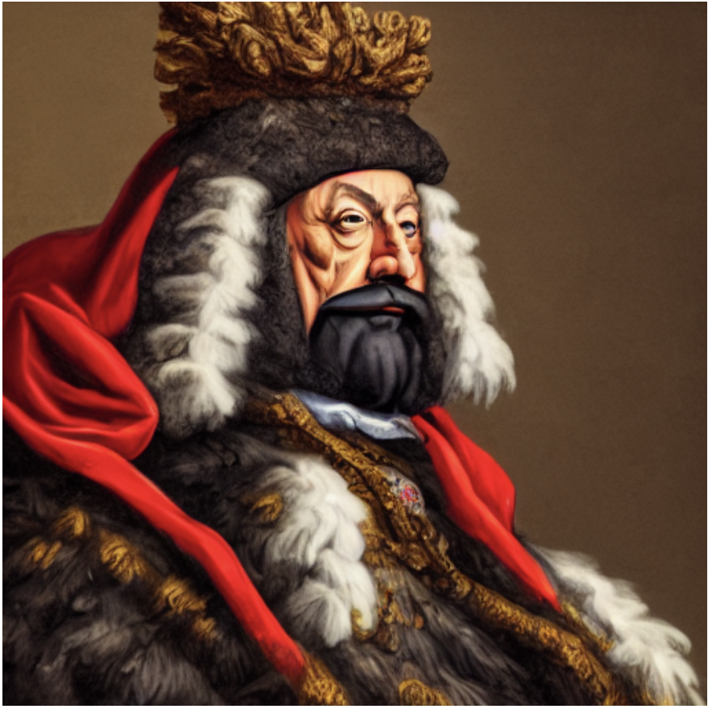
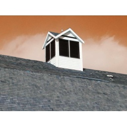
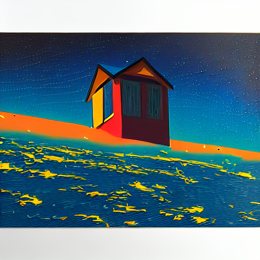
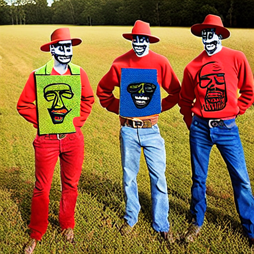

<!-- PROJECT LOGO -->
<br />
<p align="center">
  <h3 align="center">ControlLoRA-Chinese</h3>

  <p align="center">
   		 使用中文微调的控制Stable Diffusion的空间信息的轻量级网络
    <br />
  </p>
</p>

[In English](README_EN.md)

### 简单引述
[ControlLoRA](https://github.com/HighCWu/ControlLoRA)是使用LoRA技术可以简单调试stable diffusion来控制其空间信息的工程。一般使用的是简单微小的网络(~7M 参数个数, ~25M 存储)。更多的信息可以从[ControlLoRA](https://github.com/HighCWu/ControlLoRA)获得。<br/>
这个工程可以看作是[ControlLoRA](https://github.com/HighCWu/ControlLoRA)的一个fork。并依据[ControlLoRA](https://github.com/HighCWu/ControlLoRA)的方法给出两个中文领域的模型。<br/>

### 模型描述
你可以使用在线的huggingface space，上传你的图片和中文提示文本看输出结果。由于是在cpu上进行部署使用，我推荐你下载这些工程到本地并使用你的gpu进行运行。（由于"is_available"的设定，将会动态根据是否有gpu切换设备）

|名称 |HuggingFace 模型链接| HuggingFace 空间链接|
|---------|--------|-------|
|ControlNet By Canny Chinese 🔪| https://huggingface.co/svjack/canny-control-lora-zh | https://huggingface.co/spaces/svjack/ControlNet-Canny-Chinese |
|ControlNet By Pose Chinese 🏃| https://huggingface.co/svjack/pose-control-lora-zh | https://huggingface.co/spaces/svjack/ControlNet-Pose-Chinese |

### 安装和运行

#### 安装
```bash
pip install -r requirements.txt
```

#### 使用gradio部署运行
在安装后，可以cd进入[ControlNet-Canny-Chinese](ControlNet-Canny-Chinese) 和 [ControlNet-Pose-Chinese](ControlNet-Pose-Chinese) 分别运行
```bash
python app.py
```

打开你的浏览器，进入 http://localhost:7860 在浏览器进行实验。

<!--
'''
表情俏皮的小丑
满布流星的夜晚
猫咪吸血鬼
'''

'''
麦田守望者
身穿军服的军官
'''
-->

### 生成器结果比较
<table><caption>Images</caption>
<thead>
<tr>
<th>Name</th>
<th>Prompt</th>
<th colspan="1">Original Image</th>
<th colspan="1">Backbone Image</th>
<th colspan="1">Transformed Image</th>
</tr>
</thead>
<tbody>
<tr>
<td>ControlNet By Canny Chinese 🔪</td>
<td>表情俏皮的小丑</td>
<td></td>
<td></td>
<td></td>
</tr>

<tr>
<td>ControlNet By Canny Chinese 🔪</td>
<td>满布流星的夜晚</td>
<td></td>
<td></td>
<td></td>
</tr>

<tr>
<td>ControlNet By Canny Chinese 🔪</td>
<td>猫咪吸血鬼</td>
<td></td>
<td></td>
<td></td>
</tr>

<tr>
<td>ControlNet By Pose Chinese 🏃</td>
<td>麦田守望者</td>
<td></td>
<td></td>
<td></td>
</tr>

<tr>
<td>ControlNet By Pose Chinese 🏃</td>
<td>身穿军服的军官</td>
<td></td>
<td></td>
<td></td>
</tr>

</tbody>
</table>


## 更多信息和讨论
LoRA: Low-Rank Adaptation of Large Language Models
LoRA通过学习秩分解矩阵对并冻结原来的权重减少了训练参数的个数。这极大地减少了大模型对下游任务微调和任务切换的存储限制，开放部署时的推断潜力。LoRA也超过了其它很多调节模型（如：adapter, prefix-tuning, 和 fine-tuning）
<br/>
<br/>
在Stable Diffusion领域，我也提供了3个使用Lora进行微调的Stable Diffusion模型。
CC3M数据集由[svjack/img2dataset-pq2hf-transform-toolkit](https://github.com/svjack/img2dataset-pq2hf-transform-toolkit)进行下载和转换。

### 自训练的其它 Lora 相关模型展示

|名称 |HuggingFace模型链接| 语言 | 微调数据集 |
|---------|--------|-------|-------|
| svjack/pokemon-sd-lora-zh | https://huggingface.co/svjack/pokemon-sd-lora-zh | Chinese | svjack/pokemon-blip-captions-en-zh |
| svjack/concept-caption-3m-sd-lora-en | https://huggingface.co/svjack/concept-caption-3m-sd-lora-en | English | Conceptual Captions (CC3M) |
| svjack/concept-caption-3m-sd-lora-zh | https://huggingface.co/svjack/concept-caption-3m-sd-lora-zh | Chinese | Conceptual Captions (CC3M) |

你可以通过模型卡片发现如何使用这些模型。

<!-- CONTACT -->
## Contact

<!--
Your Name - [@your_twitter](https://twitter.com/your_username) - email@example.com
-->
svjack - svjackbt@gmail.com - ehangzhou@outlook.com

<!--
Project Link: [https://github.com/your_username/repo_name](https://github.com/your_username/repo_name)
-->
Project Link:[https://github.com/svjack/ControlLoRA-Chinese](https://github.com/svjack/ControlLoRA-Chinese)


<!-- ACKNOWLEDGEMENTS -->
## Acknowledgements
<!--
* [GitHub Emoji Cheat Sheet](https://www.webpagefx.com/tools/emoji-cheat-sheet)
* [Img Shields](https://shields.io)
* [Choose an Open Source License](https://choosealicense.com)
* [GitHub Pages](https://pages.github.com)
* [Animate.css](https://daneden.github.io/animate.css)
* [Loaders.css](https://connoratherton.com/loaders)
* [Slick Carousel](https://kenwheeler.github.io/slick)
* [Smooth Scroll](https://github.com/cferdinandi/smooth-scroll)
* [Sticky Kit](http://leafo.net/sticky-kit)
* [JVectorMap](http://jvectormap.com)
* [Font Awesome](https://fontawesome.com)
* [Stable Diffusion](https://stability.ai/blog/stable-diffusion-public-release)
-->
* [ControlLoRA](https://github.com/HighCWu/ControlLoRA)
* [IDEA-CCNL/Taiyi-Stable-Diffusion-1B-Chinese-v0.1](https://huggingface.co/IDEA-CCNL/Taiyi-Stable-Diffusion-1B-Chinese-v0.1)
* [diffusers](https://github.com/huggingface/diffusers)
* [DeepL](https://www.deepl.com/translator)
* [svjack/Stable-Diffusion-Chinese-Extend](https://github.com/svjack/Stable-Diffusion-Chinese-Extend)
* [svjack/Stable-Diffusion-Pokemon](https://github.com/svjack/Stable-Diffusion-Pokemon)
* [svjack](https://huggingface.co/svjack)
