<!-- PROJECT LOGO -->
<br />
<p align="center">
  <h3 align="center">ControlLoRA-Chinese</h3>

  <p align="center">
   		A Light Neural Network To Control Stable Diffusion Spatial Information tuned by Chinese
    <br />
  </p>
</p>

[中文简介](README.md)

### Brief introduction
[ControlLoRA](https://github.com/HighCWu/ControlLoRA) is a project that can easily fine-tune stable diffusion to achieve the purpose of controlling its spatial information, with LoRA, a simple and small (~7M parameters, ~25M storage space) network. More information can be seen in [ControlLoRA](https://github.com/HighCWu/ControlLoRA).<br/>
This project can be seen as a fork from [ControlLoRA](https://github.com/HighCWu/ControlLoRA) and give two models in Chinese domain use [ControlLoRA](https://github.com/HighCWu/ControlLoRA)'s source code.<br/>

### Model demonstration

You can run them in the huggingface space online, Upload your own image and
input Chinese prompt. But because the deployments are on cpu device. I recommend you download them to local and run them in your gpu. (they will switch the device dynamical because "is_available")

|Name |HuggingFace Model link| HuggingFace Space link |
|---------|--------|-------|
|ControlNet By Canny Chinese 🔪| https://huggingface.co/svjack/canny-control-lora-zh | https://huggingface.co/spaces/svjack/ControlNet-Canny-Chinese |
|ControlNet By Pose Chinese 🏃| https://huggingface.co/svjack/pose-control-lora-zh | https://huggingface.co/spaces/svjack/ControlNet-Pose-Chinese |

### Installtion and Running

#### Installtion
```bash
pip install -r requirements.txt
```

#### Running by gradio deployment
After installtion, One can cd into [ControlNet-Canny-Chinese](ControlNet-Canny-Chinese) and [ControlNet-Pose-Chinese](ControlNet-Pose-Chinese) and run
```bash
python app.py
```
respectively

Open your browser ,go to http://localhost:7860 to try it on browser.

<!--
'''
表情俏皮的小丑
满布流星的夜晚
猫咪吸血鬼
'''

'''
麦田守望者
身穿军服的军官
'''
-->

### Generator Results comparison
<table><caption>Images</caption>
<thead>
<tr>
<th>Name</th>
<th>Prompt</th>
<th colspan="1">Original Image</th>
<th colspan="1">Backbone Image</th>
<th colspan="1">Transformed Image</th>
</tr>
</thead>
<tbody>
<tr>
<td>ControlNet By Canny Chinese 🔪</td>
<td>表情俏皮的小丑</td>
<td>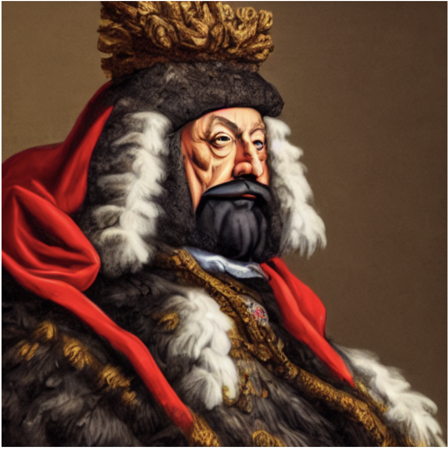</td>
<td>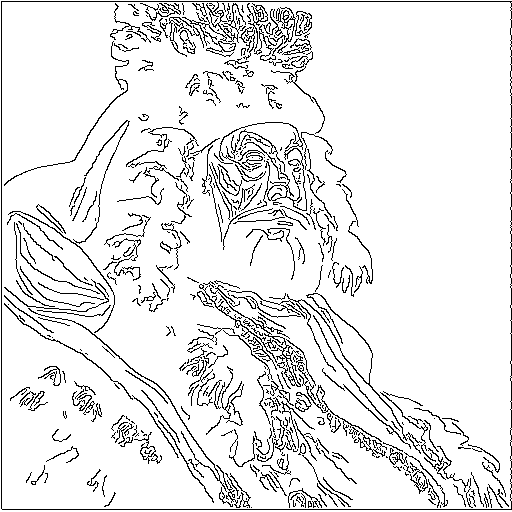</td>
<td>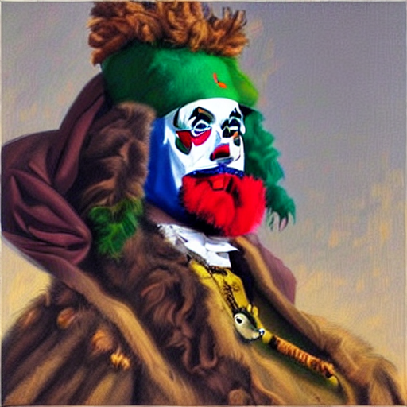</td>
</tr>

<tr>
<td>ControlNet By Canny Chinese 🔪</td>
<td>满布流星的夜晚</td>
<td>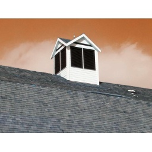</td>
<td>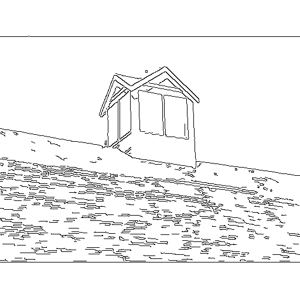</td>
<td>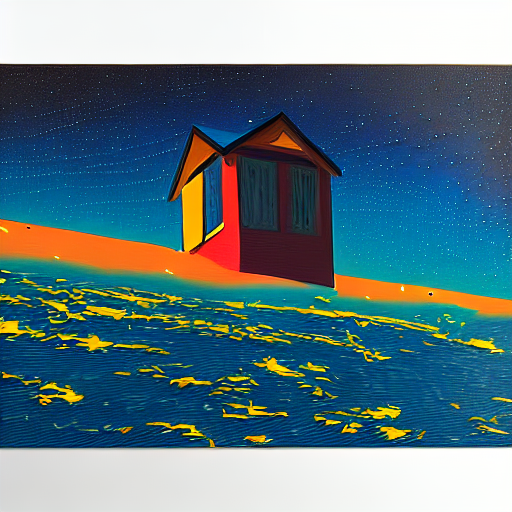</td>
</tr>

<tr>
<td>ControlNet By Canny Chinese 🔪</td>
<td>猫咪吸血鬼</td>
<td>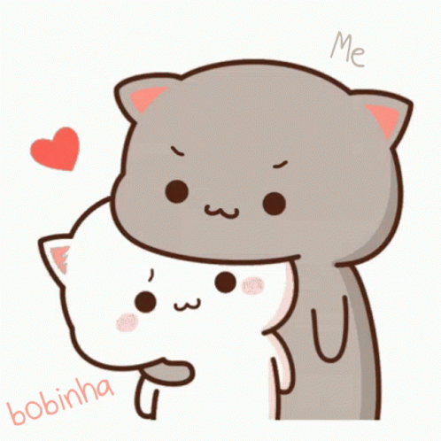</td>
<td>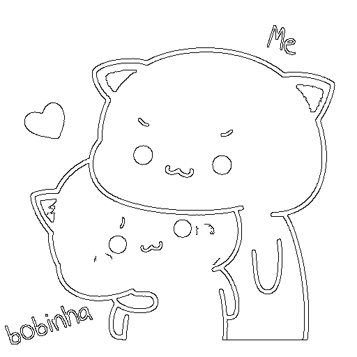</td>
<td>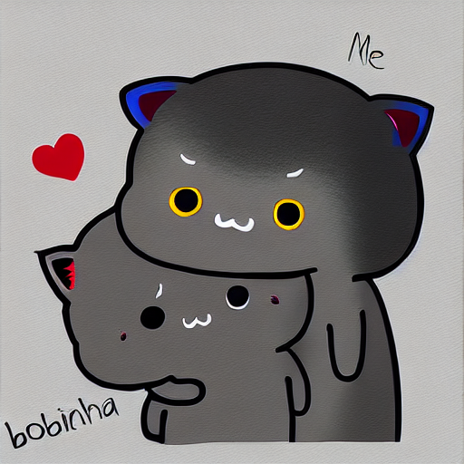</td>
</tr>

<tr>
<td>ControlNet By Pose Chinese 🏃</td>
<td>麦田守望者</td>
<td></td>
<td>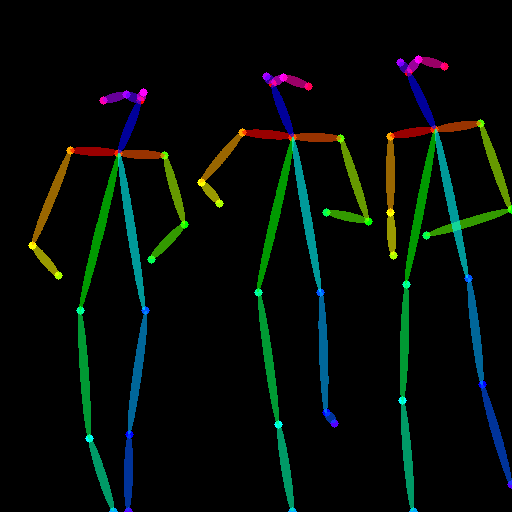</td>
<td>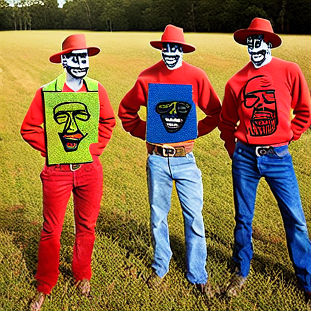</td>
</tr>

<tr>
<td>ControlNet By Pose Chinese 🏃</td>
<td>身穿军服的军官</td>
<td>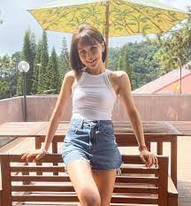</td>
<td>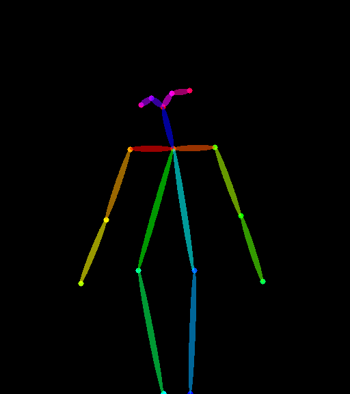</td>
<td>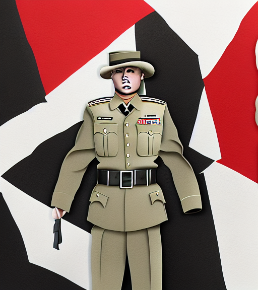</td>
</tr>

</tbody>
</table>


## More Info and Disscussion
LoRA: Low-Rank Adaptation of Large Language Models
LoRA reduces the number of trainable parameters by learning pairs of rank-decompostion matrices while freezing the original weights. This vastly reduces the storage requirement for large language models adapted to specific tasks and enables efficient task-switching during deployment all without introducing inference latency. LoRA also outperforms several other adaptation methods including adapter, prefix-tuning, and fine-tuning.
<br/>
<br/>
In the Stable Diffusion domain, I also provide three Stable Diffusion model finetuned with the help of Lora.
The CC3M dataset download and transformed with the help of repo [svjack/img2dataset-pq2hf-transform-toolkit](https://github.com/svjack/img2dataset-pq2hf-transform-toolkit)

### Self trained other Lora Related Model demonstration

|Name |HuggingFace Model link| Language | Tuned Dataset |
|---------|--------|-------|-------|
| svjack/pokemon-sd-lora-zh | https://huggingface.co/svjack/pokemon-sd-lora-zh | Chinese | svjack/pokemon-blip-captions-en-zh |
| svjack/concept-caption-3m-sd-lora-en | https://huggingface.co/svjack/concept-caption-3m-sd-lora-en | English | Conceptual Captions (CC3M) |
| svjack/concept-caption-3m-sd-lora-zh | https://huggingface.co/svjack/concept-caption-3m-sd-lora-zh | Chinese | Conceptual Captions (CC3M) |

You can check the model card to understand how to use them.

<!-- CONTACT -->
## Contact

<!--
Your Name - [@your_twitter](https://twitter.com/your_username) - email@example.com
-->
svjack - svjackbt@gmail.com - ehangzhou@outlook.com

<!--
Project Link: [https://github.com/your_username/repo_name](https://github.com/your_username/repo_name)
-->
Project Link:[https://github.com/svjack/ControlLoRA-Chinese](https://github.com/svjack/ControlLoRA-Chinese)


<!-- ACKNOWLEDGEMENTS -->
## Acknowledgements
<!--
* [GitHub Emoji Cheat Sheet](https://www.webpagefx.com/tools/emoji-cheat-sheet)
* [Img Shields](https://shields.io)
* [Choose an Open Source License](https://choosealicense.com)
* [GitHub Pages](https://pages.github.com)
* [Animate.css](https://daneden.github.io/animate.css)
* [Loaders.css](https://connoratherton.com/loaders)
* [Slick Carousel](https://kenwheeler.github.io/slick)
* [Smooth Scroll](https://github.com/cferdinandi/smooth-scroll)
* [Sticky Kit](http://leafo.net/sticky-kit)
* [JVectorMap](http://jvectormap.com)
* [Font Awesome](https://fontawesome.com)
* [Stable Diffusion](https://stability.ai/blog/stable-diffusion-public-release)
-->
* [ControlLoRA](https://github.com/HighCWu/ControlLoRA)
* [IDEA-CCNL/Taiyi-Stable-Diffusion-1B-Chinese-v0.1](https://huggingface.co/IDEA-CCNL/Taiyi-Stable-Diffusion-1B-Chinese-v0.1)
* [diffusers](https://github.com/huggingface/diffusers)
* [DeepL](https://www.deepl.com/translator)
* [svjack/Stable-Diffusion-Chinese-Extend](https://github.com/svjack/Stable-Diffusion-Chinese-Extend)
* [svjack/Stable-Diffusion-Pokemon](https://github.com/svjack/Stable-Diffusion-Pokemon)
* [svjack](https://huggingface.co/svjack)
